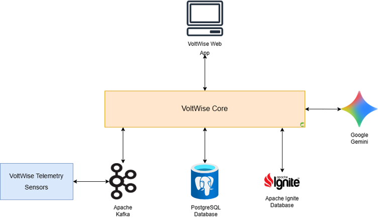
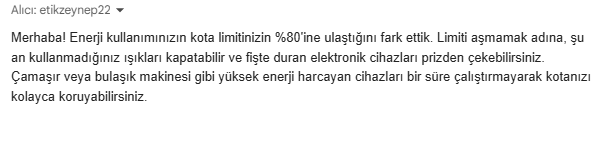
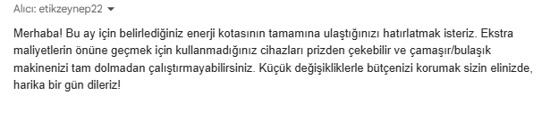
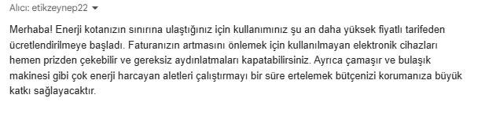
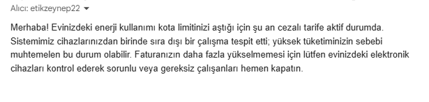

# VoltWise  

[Voltwise Web Application](http://16.192.161.28/)

Voltwise is a real tiem IoT energy analytics and budget auditing platform using Spring Boot within a modular aarchitecture implementing Apache Kafka for event driven telemetry ingestion and Apache Ignite for in memory state tracking. Also developed LLM (Gopgle Gemini API)integration for automated AI advices which will be sent through mails. For persistent audit and consumption loggings PostgreSQL schemas are designed and integrated with Apache Kafka and Apache Ignite. 
The overall technical architecture is given below:

Using docker-compose.yaml file all serivces which are Apache Ignite, Apache Kafka, PostgreSQL, Web application and Core service (backend features) are connected so just executing docker compose -d --build command will be enough to start the applicaition on localhost.

## Features and Workflow

1. It is basically used to audit the billing and power consumptions when user reach the %80 and %100 quota breaches, an email is sent to inform the user and give AI generated (by Gemini) recommendations in Turkish to cut or reduce the overall expense.

    Mails are sent in the critical threasholds which were concluded as %80 or %100 quota breaches, when penalty tariff is activated and in consecutive appliance breaches. The e-mail contents are given below:

    

    

    

    

2. Web application contains the users home registrations with determined bill and power quota filtering homes according to their quto breach status.

And each home registration have a visual card which displays appliances that home has, personalized AI generated suggestions, consumption trends and daily cost breakdown.

 ## Known Limitations

 To be able to reach the deadline of the internship some parts were not focused or overlooked. 
 The most important part is the regitration page when the realization hit it was the last day and deployment and LLM entegration has not concluded yet so the implmentation of user (owner of the house) registration could not be concluded.

 While implementing LLM module there was a bottleneck which caused by handling all the workflow through one thread -Kafka,ignite and postgreSQL logs- in one thread and adding LLM into this thread would cause sagging in the already implemented operations. There was 2 choice; create an independent cache just for LLM module and define a new Kafka topic since the implementation was easier and deadline was near it is concluded to continue with the first choice.

